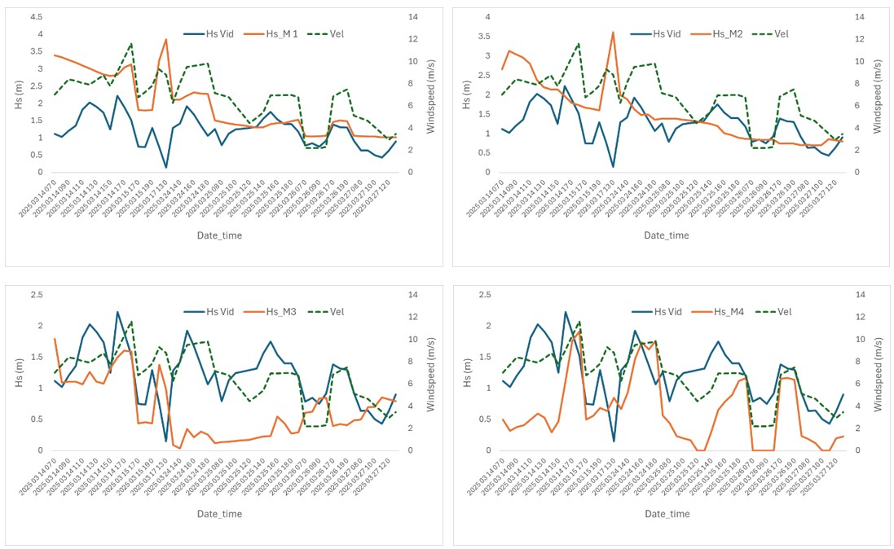
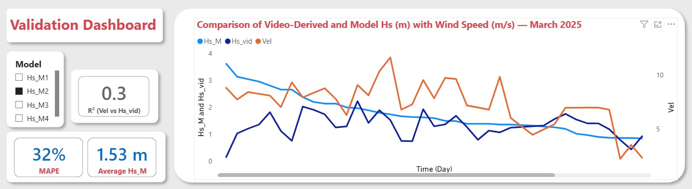
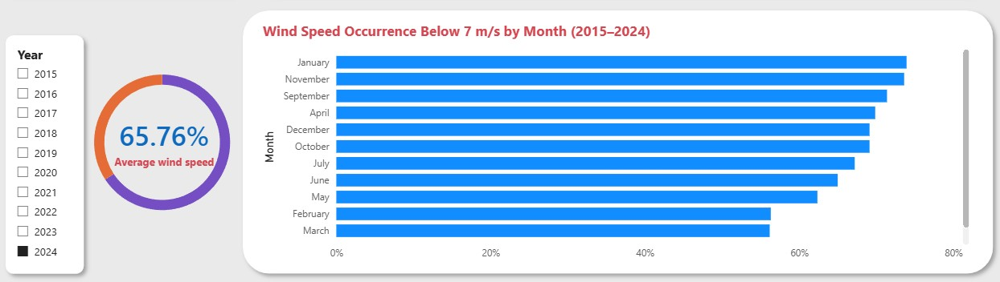

# Wave Height Validation Using Video Analytics
## Cost-Effective Coastal Monitoring Through Computer Vision & Statistical Analysis

**A data-driven approach achieving 65-75% operational availability with 32-33% MAPE accuracy, demonstrating the potential to replace expensive oceanographic sensors with video-based analytics**

---

## Executive Summary

This project validates a novel wave measurement methodology using video analytics and statistical modeling at the Port of Sines, Portugal. By processing **15,000 video frames** and applying rigorous statistical validation against wave model outputs, this work demonstrates how advanced data analysis can deliver reliable coastal monitoring at a fraction of traditional sensor costs.

**Key Metrics:**
- 📊 Dataset: 300 concurrent measurements containing Hs_vid, Hs_M1-M3, timestamps, and wind speeds (March 2025)
- 📈 Historical Context: 359,712 wind records (2015-2024) for long-term operational feasibility analysis
- ⚡ **Availability**: 65-75% annual operational capability (2015-2024 analysis)
- 💰 **Cost Impact**: Significant reduction vs. permanent ADCP installations (~€50k-100k)

---

## Project Context

Part of the **NEXUS Agenda** project focusing on digital transition at the Port of Sines, Portugal. This analysis addresses a critical operational challenge: **how to reliably measure wave parameters when deep bathymetry prevents traditional sensor installation**.

**Business Problem**: Port authorities need accurate wave data for:
- Vessel scheduling and berth safety decisions
- Infrastructure maintenance planning
- Maritime safety protocols
- Long-term coastal management strategies

**Solution**: Video-based wave height estimation validated through comprehensive statistical analysis and time-series modeling.

---

## Key Findings & Insights

### 1️⃣ **Method Reliability**

Video-derived measurements (Hs_vid) show **consistent correlation** with all three wave model outputs, validating the methodology's ability to capture nearshore wave dynamics.

**Statistical Performance:**
- Hs_M1: MAPE = 33%
- Hs_M2: MAPE = 32%
- Hs_M3: Weakest agreement (expected due to offshore-nearshore transformation)

**Interpretation**: Discrepancies align with known wave shoaling processes as waves propagate from the offshore model station (~10 km) to the nearshore measurement zone.

**Figure 1: Video-Derived vs. Model-Predicted Wave Heights**

---

### 2️⃣ **Environmental Factor Analysis**

**Wind Speed Impact:**
- R² = 0.30 between wind speed and Hs_vid
- Wind-driven generation explains ~30% of wave height variance
- Critical threshold identified: **7 m/s wind speed**

**Operational Constraints Discovered:**

| Condition | Impact on Accuracy |
|-----------|-------------------|
| Wind < 7 m/s | Optimal measurement quality |
| Wind > 7 m/s | Increased error due to whitecaps + camera shake |
| Breaking waves | Shadow detection methodology fails |

**Actionable Insight**: Quality control filtering based on wind thresholds improves data reliability for operational deployment.

**Figure 2: Wind Speed vs. Wave Height Correlation**

---

### 3️⃣ **Long-Term Feasibility Assessment**

Historical wind speed analysis (2015-2024) reveals **exceptional operational viability**:

**Annual Availability (Wind < 7 m/s):**
- Best years: 75% availability (~274 days/year)
- Worst years: 65% availability (~237 days/year)
- **Average: 70% year-round operational capability**

**Business Impact**: This high temporal coverage enables continuous monitoring at significantly lower lifecycle costs compared to permanent sensor networks requiring 24/7 maintenance.

**Figure 3: 10-Year Historical Operational Availability**

---

## Business Value & Applications

### Cost-Benefit Analysis

**Traditional Approach:**
- ADCP sensor installation: €50,000 - €100,000
- Annual maintenance: €10,000 - €15,000
- Limited spatial coverage per sensor

**Video-Based Approach:**
- Low-cost fixed camera system: ~€2,000 - €10,000 
- UAV deployments: Flexible spatial coverage
- Minimal maintenance overhead

### Target Markets

This analytical framework is directly applicable to:

1. **Port Authorities**: Real-time wave monitoring for operational decision support
2. **Coastal Engineering Firms**: Cost-effective site characterization for infrastructure projects
3. **Renewable Energy**: Wave resource assessment for offshore wind/wave energy installations
4. **Maritime Safety**: Enhanced hazard detection and navigation support
5. **Environmental Consultancies**: Long-term coastal process documentation

---

## Technical Deliverables

### 📂 Repository Contents

**[📄 Methodology Paper](https://github.com/Tidytelz/Port_data_analytics/blob/c9f2df0c0462e76daa0aa42b3290b9be17e91253/WP8_Wave%20Height%20Estimation%20Methods%20for%20Non-Breaking%20Waves%20Using%20Video%20Images.pdf)**  
Peer-reviewed methodology for wave height estimation using video imagery

**[📊 Interactive Dashboard](https://github.com/Tidytelz/Port_data_analytics/raw/refs/heads/main/Validation_dashboard.pbix)**  
Power BI dashboard with real-time KPI tracking (download .pbix file)

**[💾 Database Setup - SQL](https://github.com/Tidytelz/Port_data_analytics/blob/c3919d1fdf46af11c72cdd80b4b1bfb523b1c926/SQL_1.sql)**  
Schema design and data loading queries for multi-source integration

**[🔧 Data Preparation - SQL](https://github.com/Tidytelz/Port_data_analytics/blob/b1eac36ec943c417a2bcb074016142611ce3956a/SQL_2.sql)**  
ETL queries organizing raw data for analytical workflows

**[📐 DAX Measures](https://github.com/Tidytelz/Port_data_analytics/blob/87eb33f944d1533dca42086b196cfc1dc310fd3d/DAX.txt)**  
Custom calculations for wave height statistics, wind correlations, and operational KPIs

*Note: Video processing source code will be released upon completion of the NEXUS Agenda project*

---

## Conclusions & Recommendations

### Proven Capabilities
✅ **Validated accuracy**: 32-33% MAPE demonstrates operational viability  
✅ **High availability**: 65-75% annual deployment capability  
✅ **Cost-effective**: Significantly lower TCO vs. permanent sensors  
✅ **Scalable**: Applicable across multiple coastal monitoring contexts  

### Deployment Recommendations

**For Operational Implementation:**

1. **Camera Stabilization**: Reinforce mounting systems to reduce vibration errors during high wind (>7 m/s)

2. **Hybrid Monitoring Strategy**:
   - Fixed cameras: Continuous monitoring of critical zones
   - UAV deployments: Flexible spatial coverage during optimal weather windows

3. **Automated Quality Control**:
   - Wind speed threshold filtering (< 7 m/s)
   - Whitecap detection algorithms
   - Real-time data validation pipelines

**Ideal for organizations seeking:**
- Budget-friendly coastal monitoring without extensive capital investment
- Flexible deployment models adaptable to changing operational needs
- Data-driven decision support for maritime operations

---

## About This Project

This analysis was conducted as part of my PhD research in coastal engineering, focusing on the intersection of **computer vision, statistical modeling, and operational decision support**. The project demonstrates my ability to:

- Process large-scale datasets (15k frames, 300 sequences)
- Design end-to-end analytical pipelines
- Validate methodologies through rigorous statistical testing
- Communicate technical findings to non-technical stakeholders
- Identify business value in research outcomes

---

## Contact

**Cyril Ngene**  
PhD Researcher | Coastal Engineering & Data Analytics  
📧 Tochukwu07@gmail.com  
💼 [Linkedin](linkedin.com/in/tochukwu-ngene-3450a1117)  
💻 [GitHub Portfolio](https://github.com/Tidytelz)  
*Interested in discussing coastal monitoring analytics, video-based measurement systems, or general data-driven solutions? Let's connect!*

---

